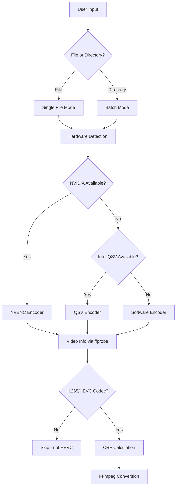

# Data Flow

## Conversion Flow

## Quality Selection Logic

CRF is automatically calculated based on source bitrate:

| Bitrate | CRF | Use Case |
|---------|-----|----------|
| < 10 Mbps | 18-19 | Preserve details in low bitrate sources |
| 10-25 Mbps | 20-21 | Balanced |
| 25-50 Mbps | 22-23 | Control size for high bitrate |
| > 50 Mbps | 23-24 | Prioritize size control |

Adjustments:
- 4K: +1 CRF (more compression)
- 720p or lower: -1 CRF (preserve quality)
- High FPS (≥50): -1 CRF (preserve detail)