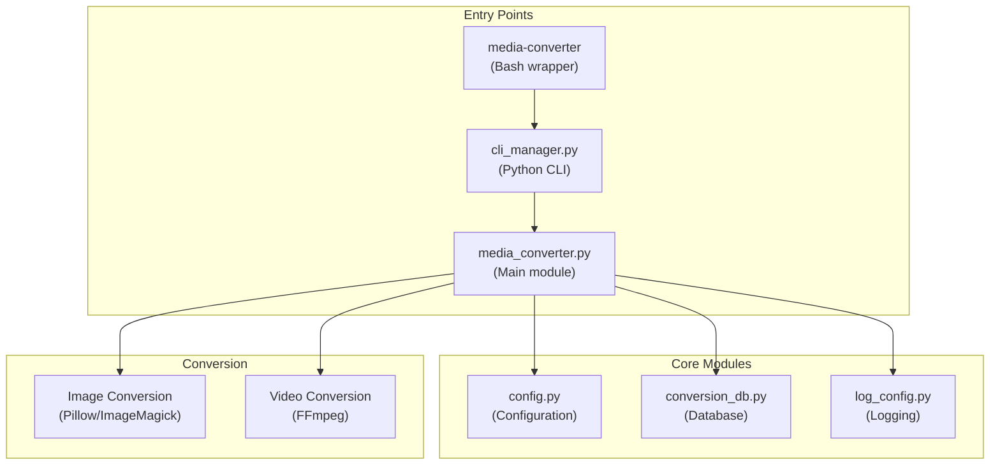

# Architecture Overview

## System Design

The Media Converter follows a modular architecture:



## Module Responsibilities

| Module | Purpose |
|--------|---------|
| `media_converter.py` | Core conversion logic (~2500 lines) |
| `cli_manager.py` | Rich-based interactive CLI (~500 lines) |
| `config.py` | Singleton configuration from .env |
| `conversion_db.py` | JSON database for tracking conversions |
| `interactive_helpers.py` | Shared prompt helpers |
| `log_config.py` | Centralized logging with rotation |
| `log_formatter.py` | Structured log formatting |
| `recovery/` | Video recovery subsystem |

## Key Design Decisions

### 1. Codec Detection by Probe, Not Extension

Only MOV/MP4 files with H.265/HEVC codec are converted. The codec is detected using ffprobe, not file extension.

### 2. Hardware Priority

```
NVIDIA NVENC > Intel QSV > Software (libx264)
```

10-bit sources force software encoding regardless of hardware availability.

### 3. JSON Conversion Database

Tracks all successful conversions to prevent duplicate work and enable smart skipping.