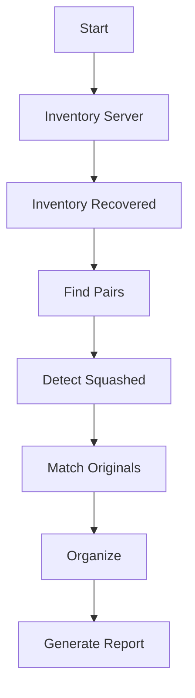

# Recovery Subsystem

## Overview

The recovery subsystem is designed to recover videos that were affected by an aspect ratio bug. It matches recovered files from PhotoRec with original files and organizes them.

## Pipeline Stages



### Stage 1-2: Inventory

Builds inventories of:
- Server files (Ellen + Mateus directories)
- Recovered files from PhotoRec

### Stage 3: Find Pairs

Matches files between Ellen and Mateus sources by comparing filenames, file sizes, and timestamps.

### Stage 4: Detect Squashed

Detects videos affected by aspect ratio squashing by comparing resolution with expected aspect ratio.

### Stage 5: Match Originals

Matches squashed files with their original versions from the recovered inventory.

### Stage 6: Organize

Moves matched pairs to organized location for review.

### Stage 7: Report

Generates comprehensive report of pairs found, squashed files detected, and match success rate.

## Usage

```bash
# Run full pipeline
python3 scripts/recovery/run_pipeline.py

# Skip inventory (use existing data)
python3 scripts/recovery/run_pipeline.py --skip-inventory

# Dry run organization
python3 scripts/recovery/run_pipeline.py --dry-run-organize
```

## Output Files

| File | Location | Description |
|------|----------|-------------|
| `server_inventory.json` | data/ | Inventory of server files |
| `recovered_inventory.json` | data/ | Inventory of recovered files |
| `pairs_found.json` | data/ | Matched pairs |
| `squashed_detected.txt` | data/ | Squashed video report |
| `recovery_report.txt` | data/ | Final recovery report |